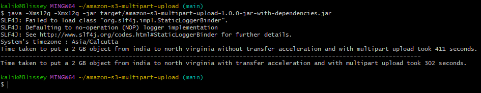

# Execution steps
1. Clone the repo at https://github.com/kalikirisrikarreddy/amazon-s3-multipart-upload to your local machine.
2. Import the project into IDE of your choice.
3. Change the bucket prefix to your liking at line number 47 in amazon.s3.multipartupload.UploadManager.java
4. Edit line 42 and 45 at amazon.s3.events.UploadManager.java to put your own AWS credentials.
5. Run mvn install to build the fat jar.
6. Run  java -jar target/amazon-s3-multipart-upload-1.0.0-jar-with-dependencies.jar command to start uploading data to your bucket.

